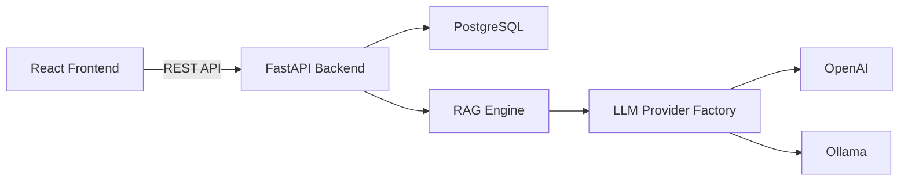

# The Lenny Growth Assistant – System Architecture

## Overview

The Lenny Growth Assistant is a full-stack AI application that helps founders and product teams generate growth advice, marketing artifacts, and business strategies using Large Language Models (LLMs) enhanced with Retrieval-Augmented Generation (RAG).

The system follows a modular architecture consisting of:

- React + TypeScript Frontend
- FastAPI Backend
- PostgreSQL Database
- Pluggable LLM Provider Layer
- Retrieval-Augmented Generation (RAG)
- Artifact Generation Engine

---

# High Level Architecture



---

# System Components

## 1. Frontend

Technology:

- React
- TypeScript
- Axios
- React Router

Responsibilities:

- Chat interface
- Session management
- Artifact generation
- Provider selection
- Markdown rendering
- User interactions

Main Pages

```
Chat
Artifacts
```

Major Components

```
Sidebar
ChatWindow
MessageInput
MessageBubble
ArtifactPanel
ArtifactViewer
ProviderSelector
```

---

# 2. Backend

Technology

- FastAPI
- SQLAlchemy
- Pydantic

Responsibilities

- Session CRUD
- Message storage
- LLM orchestration
- Provider abstraction
- RAG retrieval
- Artifact generation
- REST API

Main Modules

```
api/
services/
models/
schemas/
rag/
```

---

# 3. Database Layer

Technology

```
PostgreSQL
```

Entities

```
ChatSession

- id
- title
- created_at
- updated_at

ChatMessage

- id
- session_id
- role
- content
- created_at
```

Relationship

```
One Session
        │
        │
        ▼

Many Messages
```

---

# Chat Architecture

```mermaid
sequenceDiagram

User->>Frontend: Send message

Frontend->>Backend: POST /sessions/{id}/messages

Backend->>Database: Save user message

Backend->>RAG: Retrieve relevant documents

RAG->>Provider Factory

Provider Factory->>OpenAI/Ollama

LLM-->>Backend

Backend->>Database: Save assistant reply

Backend-->>Frontend

Frontend->>User
```

---

# LLM Provider Architecture

The project follows the Strategy Pattern.

```mermaid
flowchart TD

A[get_llm_provider()]

A --> B[OpenAI Provider]

A --> C[Ollama Provider]
```

Every provider implements the same interface.

```
LLMProvider

generate_response(messages)
```

Advantages

- Easily extensible
- Runtime provider switching
- No changes required in chat orchestration

---

# Retrieval-Augmented Generation (RAG)

Pipeline

```mermaid
flowchart LR

Markdown Documents

↓

Document Loader

↓

Chunker

↓

Retriever

↓

Prompt Builder

↓

LLM
```

Modules

### document_loader.py

Loads markdown files from the knowledge directory.

### chunker.py

Splits documents into overlapping chunks.

Chunk Size

```
500 characters
```

Overlap

```
100 characters
```

### retriever.py

Performs keyword-based retrieval and selects the Top-3 relevant chunks.

### prompt_builder.py

Constructs the final prompt.

```
System Prompt

+

Retrieved Context

+

Conversation History

+

Current User Message
```

---

# Artifact Generation

```mermaid
flowchart LR

Frontend

↓

POST /artifacts/generate

↓

Artifact Service

↓

Provider Factory

↓

OpenAI / Ollama

↓

Markdown Response

↓

Frontend Viewer
```

Supported artifact types

- Marketing Plan
- Growth Strategy
- Product Launch Plan
- Email
- Meeting Summary

---

# Provider Switching

```mermaid
flowchart LR

Dropdown

↓

POST /provider

↓

Provider Factory Override

↓

Next Request Uses New Provider
```

No server restart is required.

Supported providers

- Ollama
- OpenAI

---

# Auto Session Title Generation

Workflow

```
User sends first message

↓

If title == "Untitled Session"

↓

Generate concise title

↓

Update database

↓

Update frontend state
```

---

# API Architecture

Main Endpoints

```
GET     /sessions

POST    /sessions

DELETE  /sessions/{id}

GET     /sessions/{id}/messages

POST    /sessions/{id}/messages

POST    /artifacts/generate

GET     /provider

POST    /provider
```

---

# Folder Structure

```
backend/

api/
app/
models/
schemas/
services/
rag/
knowledge/

frontend/

components/
hooks/
pages/
services/
types/
```

---

# Design Principles

- Modular architecture
- Provider abstraction
- Separation of concerns
- Reusable components
- Dependency inversion
- Stateless REST APIs
- Configurable LLM providers
- Extensible artifact generation
- Maintainable folder structure

---

# Scalability

Future improvements may include:

- Vector database integration
- Semantic search
- Streaming LLM responses
- User authentication
- Multi-user workspaces
- Conversation memory
- Document uploads
- LangGraph workflows
- Docker deployment
- CI/CD pipeline
- Redis caching

---

# Technology Stack

| Layer | Technology |
|---------|------------|
| Frontend | React + TypeScript |
| Backend | FastAPI |
| ORM | SQLAlchemy |
| Database | PostgreSQL |
| LLM Providers | Ollama, OpenAI |
| AI Pipeline | Retrieval-Augmented Generation (RAG) |
| Markdown Rendering | React Markdown |
| HTTP Client | Axios |
| Language | Python 3.13 |
| Package Manager | npm / pip |

---

# Architecture Summary

The application uses a layered architecture where the React frontend communicates with a FastAPI backend through REST APIs. The backend manages chat sessions, retrieves contextual knowledge through a lightweight RAG pipeline, routes requests to the selected LLM provider using a provider factory, stores conversation history in PostgreSQL, and returns generated responses or artifacts to the frontend. This modular design enables easy extension, provider replacement, and future scalability while keeping each subsystem independent and maintainable.